<!-- Please do not change this html logo with link -->

# SPI to WS2812 — Use Case for CLB Using the PIC16F13145 Microcontroller with MCC Melody

This repository provides an MPLAB® X project for interfacing the Configurable Logic Block (CLB) and Serial Peripheral Interface (SPI) peripherals with a WS2812 LED matrix.

The CLB peripheral is a collection of logic elements that can be programmed to perform a wide variety of digital logic functions. The logic function may be completely combinatorial, sequential or a combination of the two, enabling users to incorporate hardware-based custom logic into their applications.

## Related Documentation

More details and code examples on the PIC16F13145 can be found at the following links:

- [PIC16F13145 Product Page](https://www.microchip.com/en-us/product/PIC16F13145?utm_source=GitHub&utm_medium=TextLink&utm_campaign=MCU8_MMTCha_PIC16F13145&utm_content=pic16f13145-spi-ws2812-mplab-mcc&utm_bu=MCU08)
- [PIC16F13145 Code Examples on Discover](https://mplab-discover.microchip.com/v2?dsl=PIC16F13145)
- [PIC16F13145 Code Examples on GitHub](https://github.com/microchip-pic-avr-examples/?q=PIC16F13145)
- [WS2818 Data Sheet](https://cdn-shop.adafruit.com/datasheets/WS2812.pdf)

## Software Used

- [MPLAB X IDE v6.20 or newer](https://www.microchip.com/en-us/tools-resources/develop/mplab-x-ide?utm_source=GitHub&utm_medium=TextLink&utm_campaign=MCU8_MMTCha_PIC16F13145&utm_content=pic16f13145-spi-ws2812-mplab-mcc&utm_bu=MCU08)
- [MPLAB XC8 v2.46 or newer](https://www.microchip.com/en-us/tools-resources/develop/mplab-xc-compilers?utm_source=GitHub&utm_medium=TextLink&utm_campaign=MCU8_MMTCha_PIC16F13145&utm_content=pic16f13145-spi-ws2812-mplab-mcc&utm_bu=MCU08)
- [PIC16F1xxxx_DFP v1.25.389 or newer](https://packs.download.microchip.com/)

## Hardware Used

- The [PIC16F13145 Curiosity Nano Development board](https://www.microchip.com/en-us/development-tool/EV06M52A?utm_source=GitHub&utm_medium=TextLink&utm_campaign=MCU8_MMTCha_PIC16F13145&utm_content=pic16f13145-tachometer-mplab-mcc&utm_bu=MCU08) is used as a test platform:
   

- WS2812 LED Matrix 8x32:
   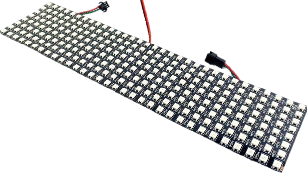

- Logic Analyzer

## Operation

To program the Curiosity Nano board with this MPLAB X project, follow the steps provided in the [How to Program the Curiosity Nano Board](#how-to-program-the-curiosity-nano-board) chapter.  

## Concept

This example demonstrates the capabilities of the CLB, a Core Independent Peripheral (CIP), that can control and manipulate the transmitted data through the SPI. The CLB can transform SPI data into the equivalent WS2812 data. The figure below shows the implemented solution.

 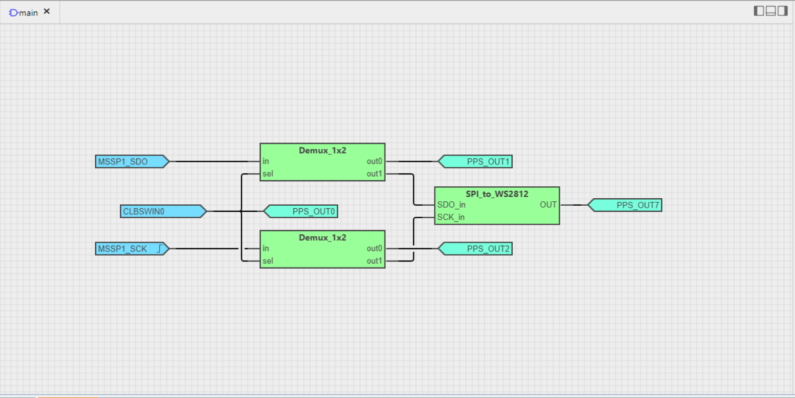

The Serial Data Out (SDO) and Serial Clock (SCK) signals define the application. The signals are inputs of the two off-sheet demux circuits, as shown in the image below. The first bit from the CLBSWIN register - `CLBSWIN[0]` - is used as the selector bit input for the same demux circuits.

The `MSSP1_SDO`, `CLBSWIN0` and `MSSP1_SCK` pins are configured as input pins for CLB, `SDO` and `SWIN0` described as synchronized inputs. The `SCK` pin is configured as a positive edge detector, which will output only pulses. Those pins are also routed to different output pins, called `PPS_OUTx`, that can be set to log the signals with a logic analyzer for debugging.

 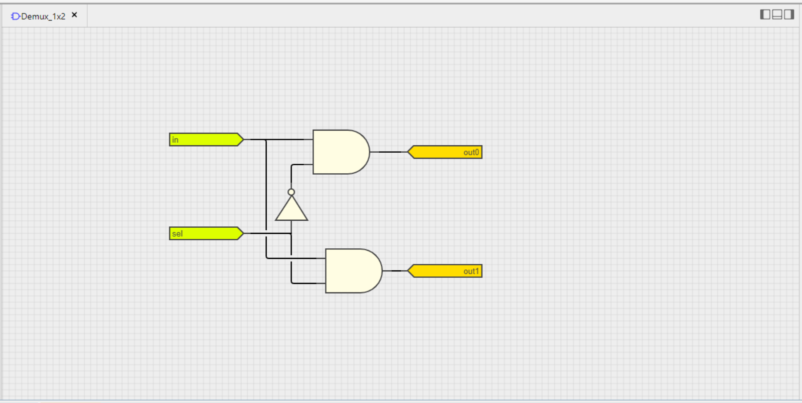

If the CLBSWIN0 bit is set, the SPI signals will be routed to the `SPI_to_WS2812` circuit, that is shown in the capture below, composed of a D Latch, a 3-bit counter with reset and one LUT. The output value of the 4-bit Look-Up Table (LUT) is `0x7E0E`, used to manage the specific timings for the WS2812 LED matrix, that can be found on its own [data sheet](https://cdn-shop.adafruit.com/datasheets/WS2812.pdf). The first three inputs of the LUT (A, B, C) are the outputs of the 3-bit counter, while the fourth input of the LUT is used to choose the right pattern for the matrix, so there are two sets of eight bits. In the green box the D value is `0`, meaning the "0 code" is chosen and described by three high periods and five low periods, and the "1 code" is described by six periods high and two periods low.. Those periods represent the right timings mentioned in the datasheet to power up the LEDs in the desired pattern.

 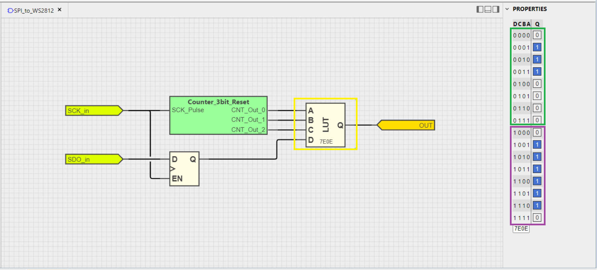

To power up an LED, a "1 code" signal must be transmitted, meaning a Pulse-Width Modulation (PWM) signal with 0.7 μs ± 150 ns high and 0.6 μs ± 150 ns low periods. To power-off, a "0 code" signal will be transmitted, meaning a PWM signal with 0.35 μs ± 150 ns high and 0.8 μs ± 150 ns low periods. For this example, the "1 code" signal is described by six high signal cycles, `1` logic, and two low signal cycles, `0` logic, and the "0 code" is composed of three high signal cycles and seven low signal cycles. Each transmitted byte describes ten cycles. The D Latch with Enable is used as the fourth input of the LUT to select the needed sequence chart for the WS2812, if the bit from the SDO signal is `0` or `1`. For a better understanding of the above information, the diagram below presents the sequence charts and timings.

 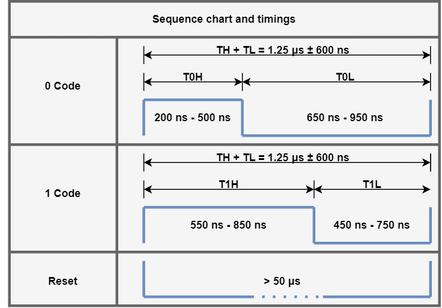

This 3-bit counter with reset is used to count up to eight values that describe each of the GRB pattern colors. Inverted SPI clock pulses reset the counter. The counter is enabled when all the outputs are high by a 3-AND gate, so the counter is kept in Reset state until the next pulse is coming. In this configuration, the counter works only when an enable pulse is met and stops and resets when the last value, 7, appears. The output values represent the input of the next LUT necessary for setting the "0 code" and "1 code". The figure below presents all the gates and pins needed to simulate the hardware counter.

 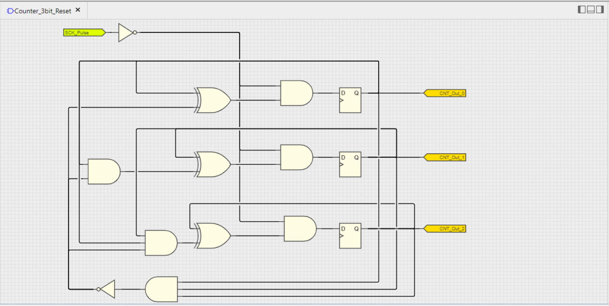

One necessary period for the WS2812 "0/1 code" is approximately 1.25 μs, and depends from a manufacturer to another. To have the desired period output, set the System Clock to 32 MHz, the CLB clock as the System Clock divided by four, and the SPI clock to 800 kHz. These settings will let the entire CLB circuit generate an output of the good timings for the WS2812 LED matrix. For other types of neopixels, the specified clock values must be changed manually to get the desired timings.

For a better understanding of the circuit, debugging output pins are used and read with a logic analyzer to display the digital signals.

 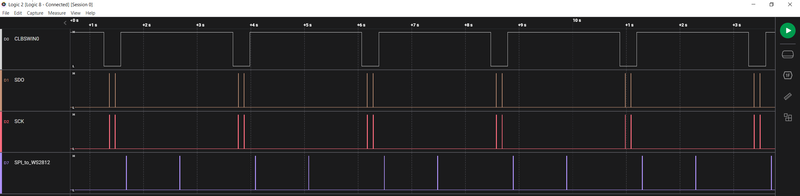

When the CLBSWIN0 is `0`, the SDO and SCK signals from the demux circuits are displayed.

 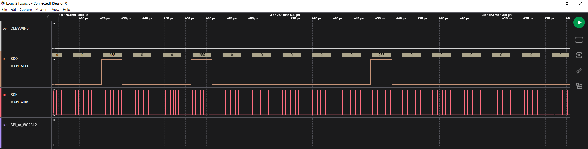

When the CLBSWIN1 is set, the SPI_to_WS2812 output that is connected next to the WS2812 matrix is displayed. The "0 code" sequence chart is made out of the first three pairs of timing markers: P0-T0H cycle, P1-T0L cycle and P2 (the joining between P0 and P1). The next three pairs of timing markers, P3-T1H cycle, P4-T1L cycle and P5 (the joining between P3 and P4), represent the "1 code" sequence chart.

 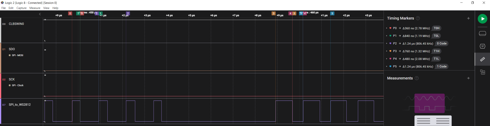

## Setup

The following peripheral and clock configurations are set up using the MPLAB Code Configurator (MCC) Melody for the PIC16F13145:

1. Configuration Bits:

   - CONFIG1:
     - External Oscillator mode selection bits: Oscillator not enabled
     - Power-up default value for COSC bits: HFINTOSC (1 MHz)
        
   - CONFIG2:
     - Brown-out reset enable bits: Brown-out reset disabled
        
   - CONFIG3:
     - WDT operating mode: WDT Disabled, SEN is ignored
        

2. Clock Control:

   - Clock Source: HFINTOSC
   - HF Internal Clock: 32_MHz
   - Clock Divider: 1
      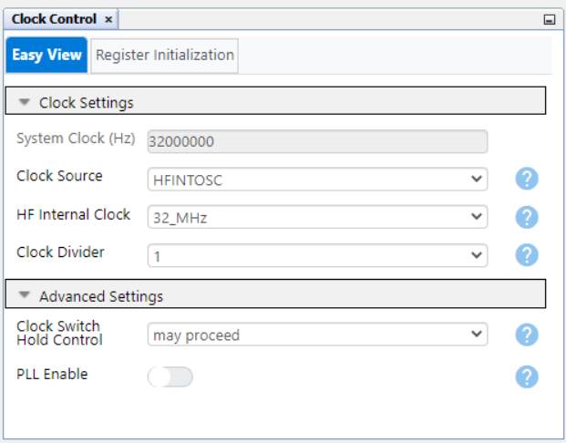

3. MSSP1 and SPI:

   - Serial Protocol: SPI
     - Mode: Host
     - SPI Mode: SPI Mode 1
     - Config Name: Custom_SPI
     - Requested Speed (kHz): 800
     - Clock Source Selection: FOSC/4_SSPxADD
        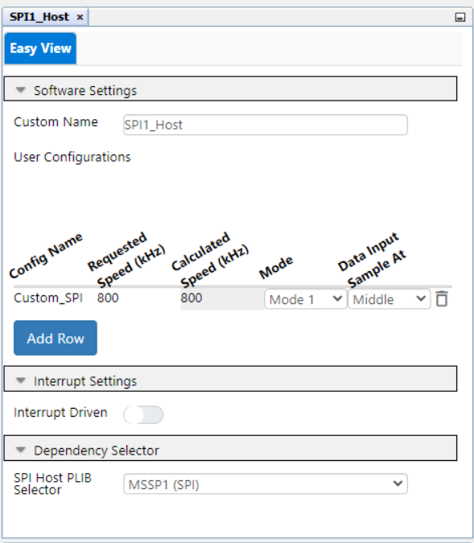 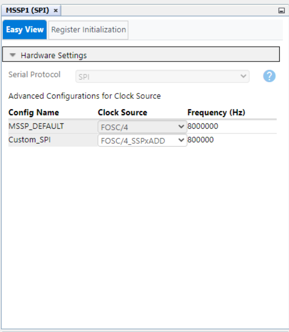

4. CLB1:

   - Enable CLB: Enabled
   - Clock Selection: HFINTOSC
   - Clock Divider: Divide clock source by 4
      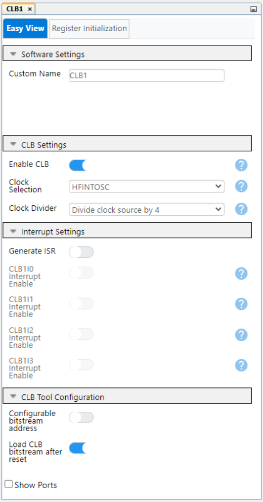

5. CRC:

   - Auto-configured by CLB

6. NVM:

   - Auto-configured by CLB

7. Pin Grid View:
   - CLBPPSOUT0: RB4 (CLBSWIN0)
   - CLBPPSOUT1: RB5 (SDO)
   - CLBPPSOUT2: RB6 (SCK)
   - CLBPPSOUT7: RB7 (SPI_to_WS2812 out)
      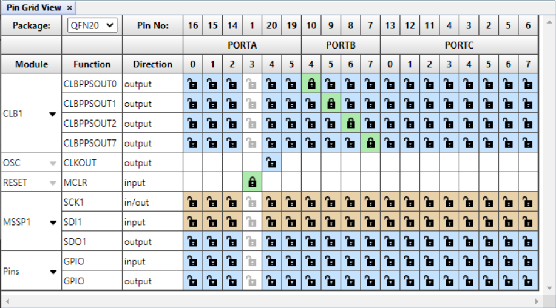

 

## Demo

Two patterns are saved in the `image.h` header file called `imageR` and `imageG` variables. Those variables help display **CLB** acronym in two different colors, red and green, as shown in the demo below. Only two wires are needed between the microcontroller and the WS2812 - the output pin from the CLB (RB7) and the ground (GND).

 

**Note:** The WS2812 matrix must be externally powered up due to higher power consumption.

 

## Summary

This example demonstrates the capabilities of the CLB, a CIP, that controls and manipulates the transmitted data through the SPI to power up a WS2812 matrix in a desired pattern.

 

## How to Program the Curiosity Nano Board

This chapter demonstrates how to use the MPLAB X IDE to program a PIC® device with an Example_Project.X. This is applicable to other projects.

1.  Connect the board to the PC.

2.  Open the `Example_Project.X` project in MPLAB X IDE.

3.  Set the `Example_Project.X` project as main project.
     Right click the project in the **Projects** tab and click **Set as Main Project**.
     

4.  Clean and build the `Example_Project.X` project.
     Right click the `Example_Project.X` project and select **Clean and Build**.
     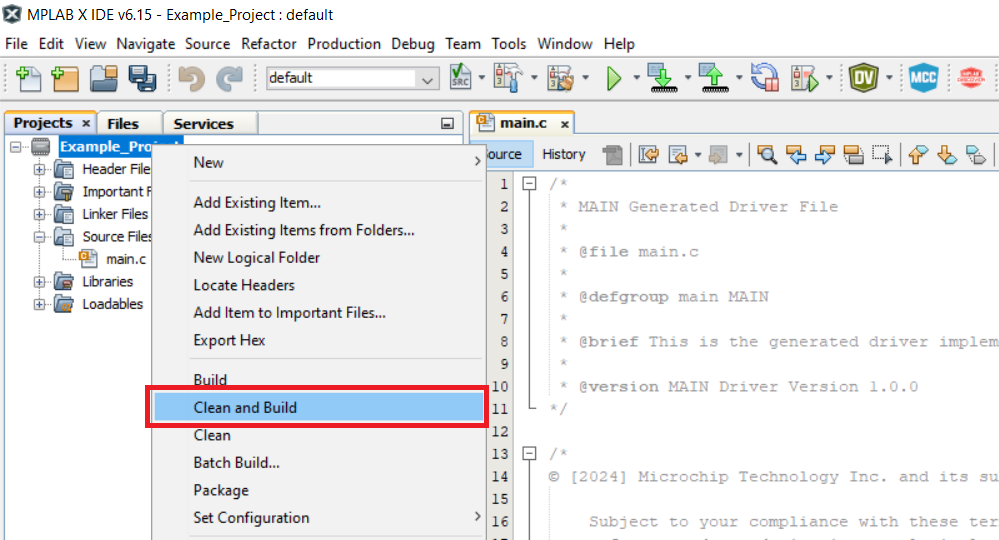

5.  Select **PICxxxxx Curiosity Nano** in the Connected Hardware Tool section of the project settings:
     Right click the project and click **Properties**.
     Click the arrow under the Connected Hardware Tool.
     Select **PICxxxxx Curiosity Nano** (click the **SN**), click **Apply** and then click **OK**:
     

6.  Program the project to the board.
     Right click the project and click **Make and Program Device**.
     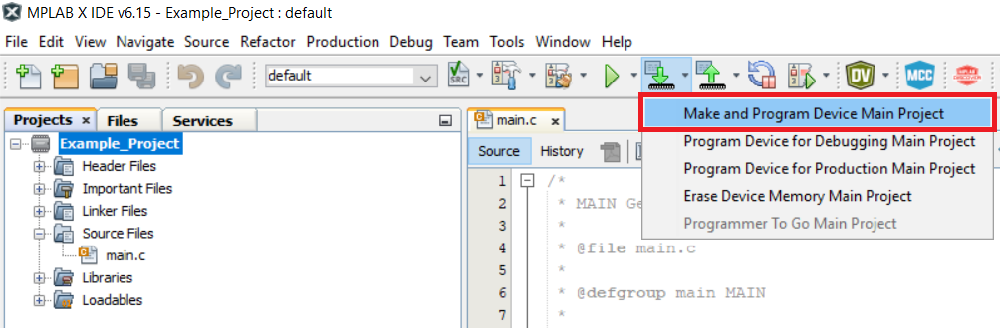

 

---

## Menu

- [Back to Top](#spi-to-ws2812--use-case-for-clb-using-the-pic16f13145-microcontroller-with-mcc-melody)
- [Back to Related Documentation](#related-documentation)
- [Back to Software Used](#software-used)
- [Back to Hardware Used](#hardware-used)
- [Back to Operation](#operation)
- [Back to Concept](#concept)
- [Back to Setup](#setup)
- [Back to Demo](#demo)
- [Back to Summary](#summary)
- [Back to How to Program the Curiosity Nano Board](#how-to-program-the-curiosity-nano-board)
