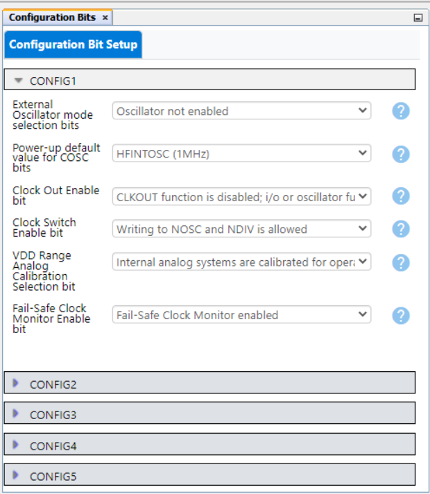

<!-- Please do not change this html logo with link -->

<a href="https://www.microchip.com" rel="nofollow"></a>

# SPI to WS2812 — Use Case for CLB using the PIC16F13145 Microcontroller with MCC Melody

This repository provides an MPLAB® X project for interfacing the Configurable Logic Block (CLB) and Serial Peripheral Interface (SPI) peripherals with WS2812 LEDs matrix. 

The CLB peripheral is a collection of logic elements that can be programmed to perform a wide variety of digital logic functions. The logic function may be completely combinatorial, sequential, or a combination of the two, enabling users to incorporate hardware-based custom logic into their applications.


## Related Documentation

More details and code examples on the PIC16F13145 can be found at the following links:

- [PIC16F13145 Product Page](https://www.microchip.com/en-us/product/PIC16F13145?utm_source=GitHub&utm_medium=TextLink&utm_campaign=MCU8_MMTCha_PIC16F13145&utm_content=pic16f13145-spi-ws2812-mplab-mcc&utm_bu=MCU08)
- [PIC16F13145 Code Examples on Discover](https://mplab-discover.microchip.com/v2?dsl=PIC16F13145)
- [PIC16F13145 Code Examples on GitHub](https://github.com/microchip-pic-avr-examples/?q=PIC16F13145)
- [WS2818 Datasheet](https://cdn-shop.adafruit.com/datasheets/WS2812.pdf)


## Software Used

- [MPLAB X IDE v6.15 or newer](https://www.microchip.com/en-us/tools-resources/develop/mplab-x-ide?utm_source=GitHub&utm_medium=TextLink&utm_campaign=MCU8_MMTCha_PIC16F13145&utm_content=pic16f13145-spi-ws2812-mplab-mcc&utm_bu=MCU08)
- [MPLAB® XC8 v2.45 or newer](https://www.microchip.com/en-us/tools-resources/develop/mplab-xc-compilers?utm_source=GitHub&utm_medium=TextLink&utm_campaign=MCU8_MMTCha_PIC16F13145&utm_content=pic16f13145-spi-ws2812-mplab-mcc&utm_bu=MCU08)
- [PIC16F1xxxx_DFP v1.23.382 or newer](https://packs.download.microchip.com/)

## Hardware Used

- The [PIC16F13145 Curiosity Nano Development board](https://www.microchip.com/en-us/development-tool/EV06M52A?utm_source=GitHub&utm_medium=TextLink&utm_campaign=MCU8_MMTCha_PIC16F13145&utm_content=pic16f13145-tachometer-mplab-mcc&utm_bu=MCU08) is used as a test platform:
    <br>

- WS2812 LED Matrix 8x32:
    <br>

- Logic Analyzer


## Operation

To program the Curiosity Nano board with this MPLAB X project, follow the steps provided in the [How to Program the Curiosity Nano Board](#how-to-program-the-curiosity-nano-board) chapter.<br><br>

## Concept

This example demonstrates the capabilities of the CLB, a Core Independent Peripheral (CIP), that can control and manipulate the transmitted data through the SPI. The figure below shows the implemented solution.

<br>

The Serial Data Out (SDO) and Serial Clock (SCK) signals define the application. The signals are inputs of the two off-sheet demux circuits, as in the image below. First bit from the CLBSWIN register - ```CLBSWIN[0]``` - is used as selector bit input for the same demux circuits.

The ```MSSP1_SDO```, ```CLBSWIN0``` and ```MSSP1_SCK``` pins are configured as input pins, ```SDO``` and ```SWIN0``` described by synchronized input. The ```SCK``` pin is configured as positive edge detector, which will output only pulses. Those pins are also routed to different output pins, called ```PPS_OUTx```, that can be set to see with a logic analyzer for debugging. 

<br>

If the CLBSWIN0 bit is set, the SPI signals will be routed to the ```SPI_to_WS2812``` circuit, that is shown in below capture, composed of an D Latch, an 3bit counter with reset and one LUT. The output values of the 4-bit LUT is ```0x7E0E``` to manage the specific timings for the WS2812 LED matrix, that can be found on its own [datasheet](https://cdn-shop.adafruit.com/datasheets/WS2812.pdf). The first 3 inputs of the LUT (A, B, C) are the outputs of the 3-bit counter and the 4th input of the LUT is used to choose the right pattern for the matrix, so there are 2 sets of 8 bits. In the green box the D value is 0, which means it is configured the “0 code” described by 3 periods high and 5 low, and for “1 code” there are 6 periods high and 2 low. Those periods represent the right timings mentioned in the datasheet to power up the LEDs in the desired pattern. 

<br>

To power-up an LED, an "1 code" signal must be transmitted, a Pulse-Width Modulation (PWM) signal with 0.7μs±150ns high and 0.35μs±150ns low periods, and "0 code" signal, a PWM signal with 0.8μs±150ns low and 0.35μs±150ns low periods, to power-off. For this example, the "1 code" signal is described by six high signal cycles, `1` logic, and two low signal cycles, `0` logic, and the "0 code" composed of three high signal cycles and seven low signal cycles. Each transmitted byte describes ten cycles. The D Latch with Enable is used as fourth input of the LUT to select the needed sequence chart for WS2812, if the bit from the SDO signal is `0` or `1`. 

This 3-bit counter with reset is used to count up to 8 values that describe each of the GRB pattern colors. Inverted SPI clock pulses reset the counter. The counter is enabled when all the outputs are high by an 3-AND gate, so the counter is kept in reset state until a next pulse is coming. In this configuration, the counter will work only when an enable pulse is met and stops and resets when the last value, 7, comes. The output values represent the input of the next LUT necessary for setting the 0 and 1 codes. The figure below presents all the gates and pins needed to simulate the hardware counter.

One necessary period for WS2812 0/1 code is approximately 1.25 μs, and depends from a manufacturer to another. To have the desired period output, set the System Clock to 32 MHz, CLB clock is the System Clock divided by four, and the SPI clock is set to 800 kHz. This setting will let the entire CLB circuit to output the good timings for WS2812 LED matrix. For other types of neopixels, the user must change the specified clock values to get the desired ones.

<br>

For a better understanding of the circuit, debugging output pins are used and read with a logic analyzer to display the digital signals.

<br>

When the CLBSWIN0 is 0, the user can see the SDO and SCK signals from demux circuits.
<br>

When the CLBSWIN1 is set, the user can observe the SPI_to_WS2812 output that is connected next to the WS2812 matrix. First three pairs of timing makers, P0 - T0H cycle, P1 - T0L cycle, and P2, the joining between P0 and P1, represent the "0 Code" sequence chart. The next three pairs of timing makers, P3 - T1H cycle, P4 - T1L cycle, and P5, the joining between P3 and P4, represent the "1 Code" sequence chart.
<br>


## Setup 

The following peripheral and clock configurations are set up using MPLAB® Code Configurator (MCC) Melody for the PIC16F13145:

1. Configurations Bits:
    - CONFIG1:
        - External Oscillator mode selection bits: Oscillator not enabled
        - Power-up default value for COSC bits: HFINTOSC (1MHz)
        <br>
    - CONFIG2:
        - Brown-out reset enable bits: Brown-out reset disabled
        <br>
    - CONFIG3:
        - WDT operating mode: WDT Disabled, SEN is ignored
        <br>

2. Clock Control:
    - Clock Source: HFINTOSC
    - HF Internal Clock: 32_MHz
    - Clock Divider: 1
    <br>

3. MSSP1 & SPI:
    - Serial Protocol: SPI
        - Mode: Host
        - SPI Mode: SPI Mode 1
        - Config Name: Custom_SPI
        - Requested Speed (kHz): 800
        - Clock Source Selection: FOSC/4_SSPxADD
       <br>   

4. CLB1:
    - Enable CLB: Enabled
    - Clock Selection: HFINTOSC
    - Clock Divider: Divide clock source by 4
    <br> 

5. CRC:
    - Auto-configured by CLB

6. NVM:
    - Auto-configured by CLB

7. Pin Grid View:
    - CLBPPSOUT0: RB4 (CLBSWIN0)
    - CLBPPSOUT1: RB5 (SDO)
    - CLBPPSOUT2: RB6 (SCK)
    - CLBPPSOUT7: RB7 (SPI_to_WS2812 out)
    <br> 

<br>


## Demo

Two patterns are saved in the ```image.h``` header file called ```imageR``` and ```imageG``` variables. Those variables contain **CLB** text in two different colors, red and green, as in the demo below. Only two wires are needed between the PIC and the WS2812 - the output pin from the CLB (RB7) and the ground (GND).

**Note:** The WS2812 matrix must be externally powered up due to higher power consumption.
<br> 


<br>

## Summary

This example demonstrates the capabilities of the CLB, a CIP, that can control and manipulate the transmitted data through the SPI to power-up in a desired pattern an WS2812 matrix.
<br>

##  How to Program the Curiosity Nano Board 

This chapter demonstrates how to use the MPLAB X IDE to program a PIC® device with an Example_Project.X. This is applicable to other projects.

1.  Connect the board to the PC.

2.  Open the Example_Project.X project in MPLAB X IDE.

3.  Set the Example_Project.X project as main project.
    <br>Right click the project in the **Projects** tab and click **Set as Main Project**.
    <br>

4.  Clean and build the Example_Project.X project.
    <br>Right click the **Example_Project.X** project and select **Clean and Build**.
    <br>

5.  Select **PICxxxxx Curiosity Nano** in the Connected Hardware Tool section of the project settings:
    <br>Right click the project and click **Properties**.
    <br>Click the arrow under the Connected Hardware Tool.
    <br>Select **PICxxxxx Curiosity Nano** (click the **SN**), click **Apply** and then click **OK**:
    <br>

6.  Program the project to the board.
    <br>Right click the project and click **Make and Program Device**.
    <br>

<br>

- - - 
## Menu
- [Back to Top](#spi-to-ws2812--use-case-for-clb-using-the-pic16f13145-microcontroller-with-mcc-melody)
- [Back to Related Documentation](#related-documentation)
- [Back to Software Used](#software-used)
- [Back to Hardware Used](#hardware-used)
- [Back to Operation](#operation)
- [Back to Concept](#concept)
- [Back to Setup](#setup)
- [Back to Demo](#demo)
- [Back to Summary](#summary)
- [Back to How to Program the Curiosity Nano Board](#how-to-program-the-curiosity-nano-board)